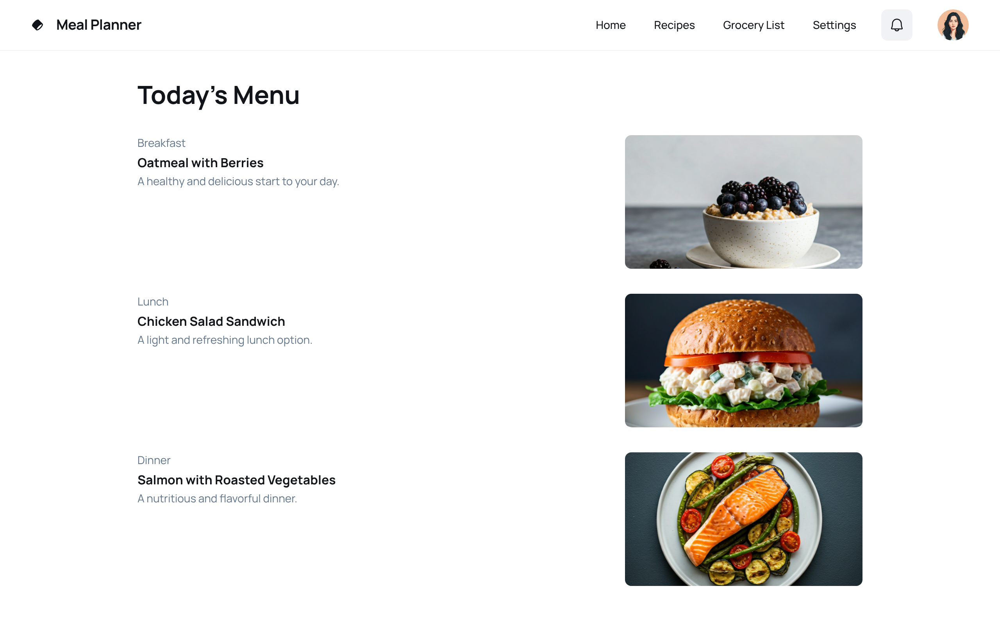
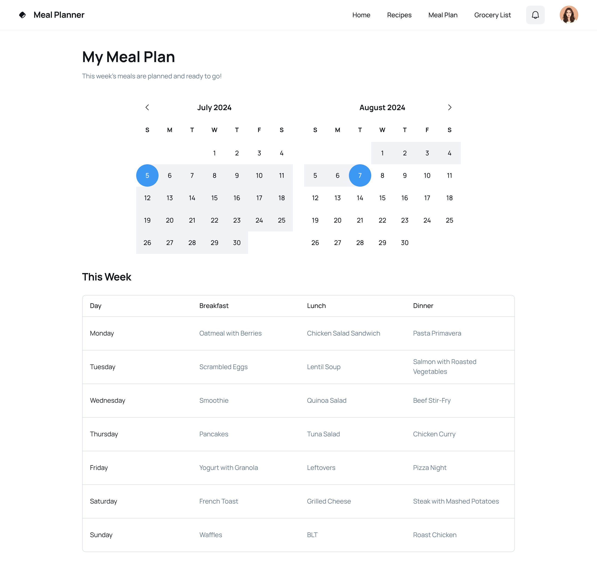
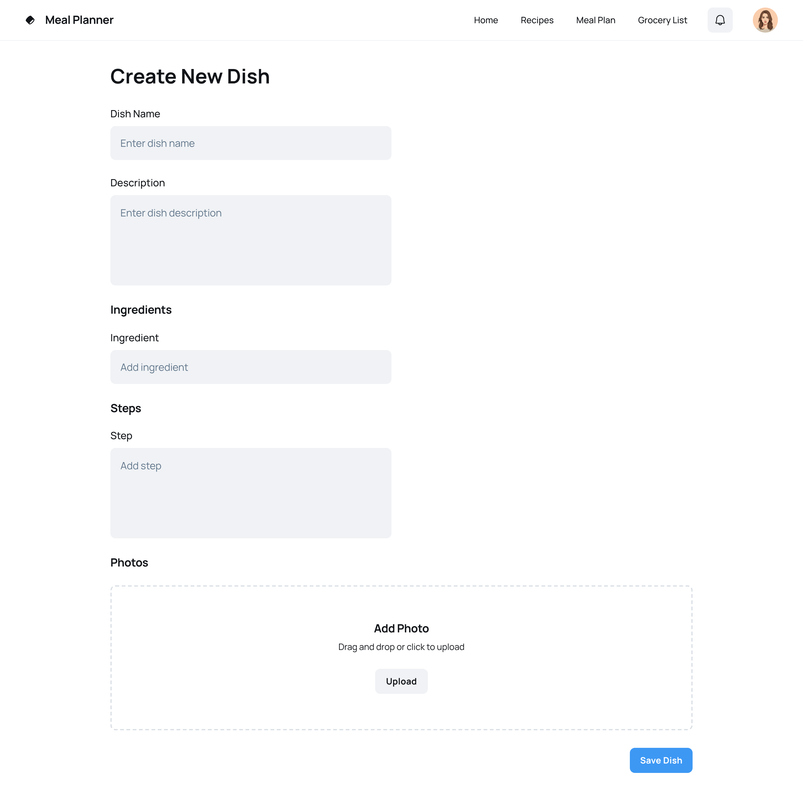
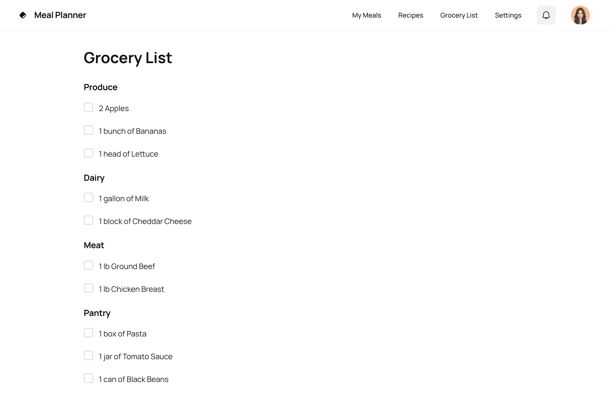

# Sistema JSON Simple para Estudiantes

Este proyecto ha sido simplificado para estudiantes. Ahora utiliza un objeto JSON simple en memoria con una arquitectura en capas clara y separada.

## 📁 Estructura del Proyecto

```
src/
├── types/
│   ├── database.ts      # Define el objeto JSON con los datos
│   ├── category.ts      # Interface para categorías
│   └── paciente.ts      # Interface para pacientes
├── repositories/        # 🆕 Capa de acceso a datos
│   ├── categoryRepository.ts    # CRUD para categorías
│   ├── pacienteRepository.ts    # CRUD para pacientes
│   └── index.ts
├── services/            # Capa de lógica de negocio
│   ├── categoryService.ts       # Lógica de negocio de categorías
│   ├── pacienteService.ts       # Lógica de negocio de pacientes
│   └── index.ts
└── presentations/       # Capa de presentación (sin cambios)
```

## 🏗️ Arquitectura en 3 Capas

### 1. **📊 Capa de Datos (Repositories)**
- **Responsabilidad**: Manejo directo del objeto JSON
- **Archivos**: `repositories/categoryRepository.ts`, `repositories/pacienteRepository.ts`
- **Qué hace**: CRUD básico, búsquedas, conteos

```typescript
// Ejemplo: CategoryRepository
export class CategoryRepository {
  static getAll(): Category[] { /* ... */ }
  static findById(id: number): Category | undefined { /* ... */ }
  static create(data: CategoryInput): Category { /* ... */ }
  static update(id: number, updates: CategoryUpdate): Category | null { /* ... */ }
  static delete(id: number): boolean { /* ... */ }
  static count(): number { /* ... */ }
}
```

### 2. **⚙️ Capa de Servicios (Services)**
- **Responsabilidad**: Lógica de negocio y orquestación
- **Archivos**: `services/categoryService.ts`, `services/pacienteService.ts`
- **Qué hace**: Validaciones, logs, reglas de negocio, usa repositories

```typescript
// Ejemplo: CategoryService
export class CategoryService {
  static async getAll(): Promise<Category[]> {
    console.log('📋 Obteniendo todas las categorías...')
    const categories = CategoryRepository.getAll()
    console.log(`✅ ${categories.length} categorías obtenidas`)
    return categories
  }
  // ... más métodos
}
```

### 3. **🖥️ Capa de Presentación (Presentations)**
- **Responsabilidad**: Interfaz de usuario
- **Archivos**: `presentations/CategoryPresentation.ts`, etc.
- **Qué hace**: Maneja DOM, eventos, llama a los services

## 🎯 ¿Qué cambió?

- ✅ **Separación por responsabilidades**: Cada capa tiene un propósito claro
- ✅ **Un archivo por entidad**: CategoryRepository, PacienteRepository
- ✅ **Fácil de entender**: Cada archivo es pequeño y específico
- ✅ **Escalable**: Agregar nuevas entidades es simple
- ✅ **Misma API en services**: No se rompe el código existente

## 📊 Base de Datos JSON

La "base de datos" sigue siendo un objeto simple en `src/types/database.ts`:

```typescript
export const database: JsonDatabase = {
  categories: [
    { id: 1, description: 'Medicina General', created_at: '2024-01-01' },
    { id: 2, description: 'Pediatría', created_at: '2024-01-01' },
    // ...
  ],
  pacientes: [
    {
      id: 1,
      nombre: 'Juan Carlos',
      apellido: 'González',
      // ...
    },
    // ...
  ]
}
```

## 🔧 Cómo Usar

### 1. **Desde Services** (Recomendado para presentaciones)
```typescript
import { CategoryService, PacienteService } from './services'

// Obtener todos
const categories = await CategoryService.getAll()
const pacientes = await PacienteService.getAll()

// Operaciones específicas
const paciente = await PacienteService.getById(1)
const pacientsFilter = await PacienteService.searchByName('Juan')
const mujeres = await PacienteService.getByGender('Femenino')
```

### 2. **Desde Repositories** (Para lógica de datos directa)
```typescript
import { CategoryRepository, PacienteRepository } from './repositories'

// Acceso directo a datos (sin logs)
const categories = CategoryRepository.getAll()
const count = CategoryRepository.count()
const paciente = PacienteRepository.findById(1)
```

## 📚 Ventajas Educativas

### **Para Estudiantes:**
1. **Separación clara**: Cada capa tiene una responsabilidad específica
2. **Fácil de encontrar**: ¿Necesitas CRUD? → Repository. ¿Lógica? → Service
3. **Escalable**: Agregar `ProductRepository` es copiar y adaptar
4. **Patrones reales**: Repository pattern se usa en la industria
5. **Debugging simple**: Los logs están en Services, la data en Repositories

### **Para Profesores:**
- Enseñar **responsabilidades únicas** por archivo
- Mostrar **flujo de datos**: Presentation → Service → Repository → JSON
- Explicar **inyección de dependencias** conceptualmente
- Demostrar **testing** por capas

## 🚀 Agregar Nueva Entidad

Para agregar, por ejemplo, "Doctores":

1. **Crear interface**: `types/doctor.ts`
2. **Agregar al JSON**: `types/database.ts`
3. **Crear repository**: `repositories/doctorRepository.ts`
4. **Crear service**: `services/doctorService.ts`
5. **Crear presentation**: `presentations/DoctorPresentation.ts`

## ⚠️ Importante

- **Los datos se pierden al recargar** - Es temporal para aprender
- **No hay persistencia** - Enfócate en la arquitectura
- **Logs informativos** - Ayudan a ver el flujo de datos
- **Código simple** - Sin complejidades innecesarias

¡Perfecto para aprender arquitectura limpia y separación de responsabilidades! 🎓 


## A continuación la explicación de lo desarrollado en el repositorio:
## Aplicación para la planificación alimenticia de tu familia

# Sistema de Planificación Alimenticia Familiar

# Sistema de Planificación Alimenticia Familiar

Este proyecto es una aplicación educativa que permite planificar comidas, gestionar listas de compras, ejercicios, usuarios y organizar categorías relacionadas, usando una arquitectura en capas y almacenamiento en memoria mediante objetos JSON.

---

## 📁 Estructura del Proyecto

```
src/
├── models/
│   ├── category.ts         # Categoría de comidas
│   ├── comida.ts           # Comidas/platos
│   ├── shopCategory.ts     # Categoría de productos de compra
│   ├── shoplist.ts         # Lista de compras
│   ├── excerciseCat.ts     # Categoría de ejercicios
│   ├── exercise.ts         # Ejercicios
│   ├── user.ts             # Usuarios
├── components/
│   ├── CategoryForm.ts     # Formulario de categoría de comida
│   ├── CategoryList.ts     # Lista de categorías de comida
│   ├── FoodForm.ts         # Formulario de comida/plato
│   ├── ShopCategoryForm.ts # Formulario de categoría de compras
│   ├── ShopListForm.ts     # Formulario de lista de compras
│   ├── ShopListList.ts     # Lista de compras
│   ├── ExerciseForm.ts     # Formulario de ejercicio
│   ├── ExerciseList.ts     # Lista de ejercicios
├── types/
│   ├── database.ts         # Objeto JSON principal (base de datos en memoria)
├── repositories/           # Acceso a datos (CRUD)
│   ├── categoryRepository.ts
│   ├── foodRepo.ts
│   ├── shopCategoryRepository.ts
│   ├── ShopRepo.ts
│   ├── excerciseCatRepository.ts
│   ├── exerciseRepository.ts
│   ├── userRepo.ts
├── services/               # Lógica de negocio
│   ├── categoryService.ts
│   ├── comidaService.ts
│   ├── shopCategoryService.ts
│   ├── shoplistService.ts
│   ├── excerciseCatService.ts
│   ├── exerciseService.ts
│   ├── userService.ts
└── presentations/          # Presentación (gestión de vistas y eventos)
```

---

## 🏗️ Arquitectura en 3 Capas

1. **Capa de Datos (Repositories)**
   - CRUD sobre los objetos JSON en memoria.
   - Ejemplo: `CategoryRepository`, `FoodRepository`, `ShopRepository`, `UserRepository`, etc.

2. **Capa de Servicios (Services)**
   - Lógica de negocio, validaciones y orquestación.
   - Ejemplo: `CategoryService`, `ComidaService`, etc.

3. **Capa de Presentación (Components/Presentations)**
   - Manejo de formularios, listas y eventos del DOM.
   - Ejemplo: `CategoryForm`, `FoodForm`, `ShopListForm`, etc.

---

## 🥗 Entidades Principales

- **Category**: Categoría de comidas (ej: Desayuno, Almuerzo, Cena).
- **Comida**: Plato o comida, con nombre, categoría, sabor, unidad, tiempo de preparación, calorías, fecha de creación.
- **ShopCategory**: Categoría de productos para la lista de compras.
- **ShopList**: Lista de compras, con ítems (arreglo de strings), cantidad, categoría y estado (completado o no).
- **ExerciseCat**: Categoría de ejercicios (ej: Cardio, Fuerza).
- **Exercise**: Ejercicio, con nombre, categoría, descripción, duración e intensidad.
- **User**: Usuario del sistema, con nombre, email, teléfono, contraseña (no implementada), y estado activo.

---

## 🖥️ Componentes Destacados

- **Formularios reutilizables** para crear y editar entidades (comidas, categorías, ejercicios, listas de compras, usuarios).
- **Listados** con acciones de editar y eliminar.
- **Selección de categorías** en formularios mediante `<select>`.
- **Validaciones básicas** en los formularios antes de enviar datos.

---

## 📊 Base de Datos JSON (Ejemplo Simplificado)

```typescript
export const database = {
  categories: [
    { id: 1, name: 'Desayuno', description: 'Comidas para la mañana', created_at: '2025-06-13' }
  ],
  comidas: [
    {
      id: 1,
      name: 'Ensalada César',
      category: { id: 1, name: 'Almuerzo', description: 'Comidas del mediodía', created_at: '2025-06-13' },
      flavor: 'Salado',
      unity: 'porción',
      preparation_time: 15,
      created_at: '2025-06-13',
      calories: 180
    }
  ],
  shopCategories: [
    { id: 1, name: 'Lácteos' }
  ],
  shoplists: [
    {
      id: 1,
      item: ['pan', 'lechuga', 'tomate', 'queso'],
      quantity: 4,
      type: { id: 1, name: 'Lácteos' },
      done: false
    }
  ],
  exerciseCats: [
    { id: 1, category: 'Cardio', description: 'Ejercicios cardiovasculares' }
  ],
  exercises: [
    {
      id: 1,
      name: 'Correr',
      type: { id: 1, category: 'Cardio', description: 'Ejercicios cardiovasculares' },
      description: 'Correr al aire libre',
      duration: '30 min',
      intensity: 'Alta'
    }
  ],
  users: [
    {
      id: 1,
      name: 'Juan Pérez',
      email: 'juan@example.com',
      phone: '123456789',
      password: undefined,
      active: true
    }
  ]
}
```

---

## 🚀 ¿Cómo usar?

### Desde Services (recomendado)
```typescript
import { ComidaService, ShopListService, UserService } from './services'

const comidas = await ComidaService.getAll()
const lista = await ShopListService.getAll()
const usuarios = await UserService.getAll()
```

### Desde Repositories (acceso directo a datos)
```typescript
import { FoodRepository, ShopRepository, UserRepository } from './repositories'

const comidas = FoodRepository.getAll()
const listas = ShopRepository.getAll()
const usuarios = UserRepository.getAll()
```

---

## 🎯 Ventajas Educativas

- **Separación clara de responsabilidades** por capa.
- **Fácil de extender**: agrega nuevas entidades copiando el patrón.
- **Ideal para aprender arquitectura limpia** y patrones como Repository y Service.
- **Sin persistencia**: los datos se pierden al recargar, ideal para pruebas y aprendizaje.

---

## 📚 Ejemplo de Uso en la Aplicación

- Planifica las comidas de la semana para tu familia.
- Crea y edita platos, asignando ingredientes y categorías.
- Genera automáticamente la lista de compras según los ingredientes de los platos seleccionados.
- Gestiona rutinas de ejercicios y sus categorías.
- Administra usuarios del sistema.

---

## ⚠️ Notas y Errores Detectados

- **Los datos se pierden al recargar** (no hay persistencia).
- **El campo `password` en usuarios está como `undefined`**: esto no es seguro ni funcional para un sistema real, solo es un placeholder educativo.
- **El objetivo es educativo**: enfócate en la arquitectura y la separación de responsabilidades.
- **Puedes adaptar y ampliar el proyecto** para tus necesidades.
-** Componentes ShopRepo.ts, userRepo.ts y FoodForm.ts no funcionan**, services no actualizados, no existen componentes visuales

---

¡Perfecto para aprender arquitectura de software y buenas prácticas en

¡Perfecto para aprender arquitectura de software y buenas prácticas en TypeScript!

La primera imagen muestra lo que un usuario debe observar cuando accede a su app. Lo que su familia disfrutará el día de hoy.



La segunda imagen es la planificación que la puede realizar cualquier miembro adulto de la familia. Al escoger un rango de fechas el usuario puede asignar que plato se servirá en esos días tanto en desayuno, como almuerzo y merienda.



En la tercera imagen se muestra como se crea un nuevo plato, incluyendo el detalle de los ingredientes del mismo.



En la cuarta imagen apreciamos como la aplicación puede mostrar también el mismo plato en otro formato de visualización y permitiendo que los miembros de la familia comenten sobre el mismo.


En la quinta imagen podemos apreciar que en base a los ingredientes de estos platos escogidos por un periodo específico es posible conocer un detalle de los producto que se van a requerir y así armar su lista de compras.



Tomar en cuenta todos los atributos que aunque no explícitos en las imágenes te ayudarán a estructurar tus objetos y sus relaciones. 
